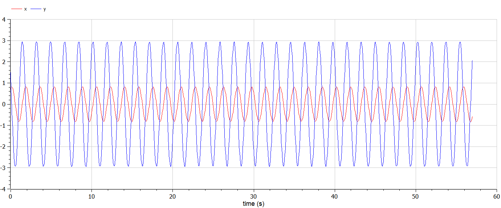

---
# Front matter
title: "Отчёт по лабораторной работе №4"
subtitle: "Модель гармонических колебаний"
author: "Ишанова А.И. группа НФИБД-02-19"

# Generic otions
lang: ru-RU
toc-title: "Содержание"

# Pdf output format
toc: true # Table of contents
toc_depth: 2
lof: true # List of figures
lot: false # List of tables
fontsize: 12pt
linestretch: 1.5
papersize: a4
documentclass: scrreprt
## I18n
polyglossia-lang:
  name: russian
  options:
	- spelling=modern
	- babelshorthands=true
polyglossia-otherlangs:
  name: english
### Fonts
mainfont: PT Serif
romanfont: PT Serif
sansfont: PT Sans
monofont: PT Mono
mainfontoptions: Ligatures=TeX
romanfontoptions: Ligatures=TeX
sansfontoptions: Ligatures=TeX,Scale=MatchLowercase
monofontoptions: Scale=MatchLowercase,Scale=0.9
## Biblatex
biblatex: true
biblio-style: "gost-numeric"
biblatexoptions:
  - parentracker=true
  - backend=biber
  - hyperref=auto
  - language=auto
  - autolang=other*
  - citestyle=gost-numeric
## Misc options
indent: true
header-includes:
  - \linepenalty=10 # the penalty added to the badness of each line within a paragraph (no associated penalty node) Increasing the value makes tex try to have fewer lines in the paragraph.
  - \interlinepenalty=0 # value of the penalty (node) added after each line of a paragraph.
  - \hyphenpenalty=50 # the penalty for line breaking at an automatically inserted hyphen
  - \exhyphenpenalty=50 # the penalty for line breaking at an explicit hyphen
  - \binoppenalty=700 # the penalty for breaking a line at a binary operator
  - \relpenalty=500 # the penalty for breaking a line at a relation
  - \clubpenalty=150 # extra penalty for breaking after first line of a paragraph
  - \widowpenalty=150 # extra penalty for breaking before last line of a paragraph
  - \displaywidowpenalty=50 # extra penalty for breaking before last line before a display math
  - \brokenpenalty=100 # extra penalty for page breaking after a hyphenated line
  - \predisplaypenalty=10000 # penalty for breaking before a display
  - \postdisplaypenalty=0 # penalty for breaking after a display
  - \floatingpenalty = 20000 # penalty for splitting an insertion (can only be split footnote in standard LaTeX)
  - \raggedbottom # or \flushbottom
  - \usepackage{float} # keep figures where there are in the text
  - \floatplacement{figure}{H} # keep figures where there are in the text
---

# Цель работы

Научиться строить модель гармонических колебаний.

# Задание

Рассмотреть три простейшие модели гармонических колебаний, построить графики для каждой из них, перенести матемотическую модель в код (OpenModelica).

## Вариант № 18

Постройте фазовый портрет гармонического осциллятора и решение уравнения гармонического осциллятора для следующих случаев:

1. Колебания гармонического осциллятора без затуханий и без действий внешней силы $\ddot{x}+13x=0$;
2. Колебания гармонического осциллятора c затуханием и без действий внешней силы $\ddot{x}+7\dot{x}+x=0$;
3. Колебания гармонического осциллятора c затуханием и под действием внешней силы $\ddot{x}+\dot{x}+30x=sin(0.6t)$.

На интервале $t \in {0; 57}$ (шаг 0.05) с начальными условиями $x_0 = 0.7$, $y_0 = 1.5$.

[1]

# Теоретическое введение

Гармонические колебания — колебания, при которых физическая величина изменяется с течением времени по гармоническому (синусоидальному, косинусоидальному) закону.[2]

Уравнение свободных колебаний гармонического осциллятора имеет следующий вид:

$\ddot{x}+2\gamma\dot{x}+w_0^2x=0$

где $x$ – переменная, описывающая состояние системы (смещение грузика, заряд конденсатора и т.д.), $\gamma$– параметр, характеризующий потери энергии (трение в
механической системе, сопротивление в контуре), $w_0$ – собственная частота колебаний, $t$ – время. (Обозначения $\ddot{x}=\frac{\partial^2x}{\partial t^2}$, $\dot{x}=\frac{\partial x}{\partial t}$)

При отсутствии потерь в системе $(\gamma = 0)$ получаем уравнение консервативного осциллятора, энергия колебания которого сохраняется во времени.

$\ddot{x}+w_0^2x=0$

Для однозначной разрешимости уравнения второго порядка необходимо задать два начальных условия вида:

$$
\begin{cases}
x(t_0) = x_0\\
\dot{x}(t_0)=y_0
\end{cases}
$$

Уравнение второго порядка можно представить в виде системы двух уравнений первого порядка:

$$
\begin{cases}
\dot{x}=y\\
\dot{y}=-w_0^2x
\end{cases}
$$

Начальные условия примут вид:

$$
\begin{cases}
x(t_0) = x_0\\
y(t_0)=y_0
\end{cases}
$$

Независимые переменные $x$, $y$ определяют пространство, в котором «движется» решение. Это фазовое пространство системы, поскольку оно двумерно будем называть его фазовой плоскостью.

Значение фазовых координат $x$, $y$ в любой момент времени полностью определяет состояние системы. Решению уравнения движения как функции времени отвечает гладкая кривая в фазовой плоскости. Она называется фазовой траекторией. Если множество различных решений (соответствующих различным начальным условиям) изобразить на одной фазовой плоскости, возникает общая картина поведения системы. Такую картину, образованную набором фазовых траекторий, называют фазовым портретом. [1]

# Выполнение лабораторной работы

1. Пишем код для первой модели. (@fig:001)

$\ddot{x}+13x=0$

Для данной модели:
$\gamma = 0$;
$w_0^2=13$;
$$
    \begin{cases}
    \dot{x}=y\\
    \dot{y}=-w_0^2x
    \end{cases}
    $$

{ #fig:001 width=100%}

2. Компилируем, моделируем и получаем график. (@fig:002 и @fig:003)

{ #fig:002 width=100%}

{ #fig:003 width=100%}

3. Пишем код для второй модели. (@fig:004)

$\ddot{x}+7\dot{x}+x=0$

Для данной модели:
$\gamma = 3.5$;
$w_0^2=1$;
$$
    \begin{cases}
    \dot{x}=y\\
    \dot{y}=-2\gamma y-w_0^2x
    \end{cases}
    $$

{ #fig:004 width=100%}

4. Компилируем, моделируем и получаем график. (@fig:005 и @fig:006)

{ #fig:005 width=100%}

{ #fig:006 width=100%}

5. Пишем код для второй модели. (@fig:007)

$\ddot{x}+\dot{x}+30x=sin(0.6t)$

Для данной модели:
$\gamma = 0.5$;
$w_0^2=30$;
$$
    \begin{cases}
    \dot{x}=y\\
    \dot{y}=-2\gamma y-w_0^2x+sin(0.6t)
    \end{cases}
    $$

{ #fig:007 width=100%}

6. Компилируем, моделируем и получаем график. (@fig:008 и @fig:009)

{ #fig:008 width=100%}

{ #fig:009 width=100%}

# Выводы

В ходе выполнения данной работы мы познакомились с простейшей моделью гармонических колебаний осциллятора, с и без затухания, с и без воздействия внешней силы и реализовали модели в OpenModelica для трех заданных случаев.

# Список литературы

1. Методические материалы курса
2. Wikipedia: https://ru.wikipedia.org/wiki/Гармонические_колебания
