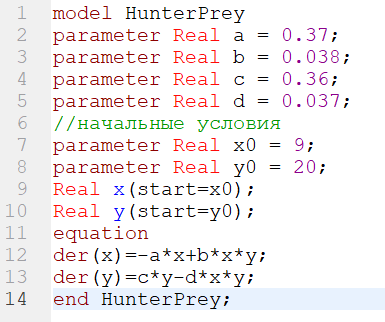
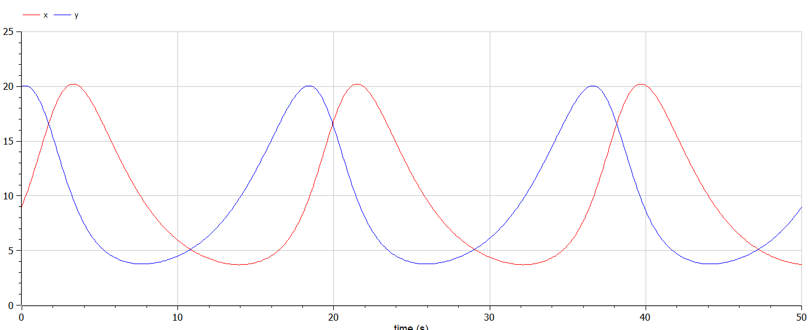
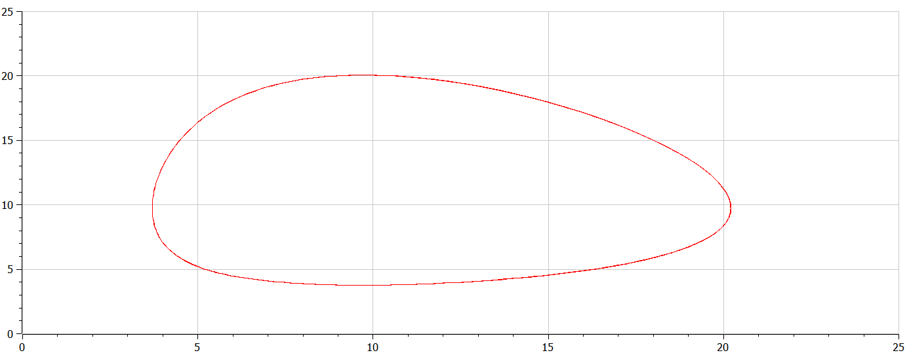
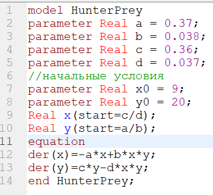
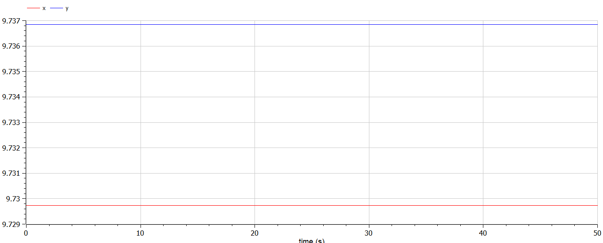

---
# Front matter
title: "Отчёт по лабораторной работе №5"
subtitle: "Модель хищник-жертва"
author: "Ишанова А.И. группа НФИБД-02-19"

# Generic otions
lang: ru-RU
toc-title: "Содержание"

# Pdf output format
toc: true # Table of contents
toc_depth: 2
lof: true # List of figures
lot: false # List of tables
fontsize: 12pt
linestretch: 1.5
papersize: a4
documentclass: scrreprt
## I18n
polyglossia-lang:
  name: russian
  options:
	- spelling=modern
	- babelshorthands=true
polyglossia-otherlangs:
  name: english
### Fonts
mainfont: PT Serif
romanfont: PT Serif
sansfont: PT Sans
monofont: PT Mono
mainfontoptions: Ligatures=TeX
romanfontoptions: Ligatures=TeX
sansfontoptions: Ligatures=TeX,Scale=MatchLowercase
monofontoptions: Scale=MatchLowercase,Scale=0.9
## Biblatex
biblatex: true
biblio-style: "gost-numeric"
biblatexoptions:
  - parentracker=true
  - backend=biber
  - hyperref=auto
  - language=auto
  - autolang=other*
  - citestyle=gost-numeric
## Misc options
indent: true
header-includes:
  - \linepenalty=10 # the penalty added to the badness of each line within a paragraph (no associated penalty node) Increasing the value makes tex try to have fewer lines in the paragraph.
  - \interlinepenalty=0 # value of the penalty (node) added after each line of a paragraph.
  - \hyphenpenalty=50 # the penalty for line breaking at an automatically inserted hyphen
  - \exhyphenpenalty=50 # the penalty for line breaking at an explicit hyphen
  - \binoppenalty=700 # the penalty for breaking a line at a binary operator
  - \relpenalty=500 # the penalty for breaking a line at a relation
  - \clubpenalty=150 # extra penalty for breaking after first line of a paragraph
  - \widowpenalty=150 # extra penalty for breaking before last line of a paragraph
  - \displaywidowpenalty=50 # extra penalty for breaking before last line before a display math
  - \brokenpenalty=100 # extra penalty for page breaking after a hyphenated line
  - \predisplaypenalty=10000 # penalty for breaking before a display
  - \postdisplaypenalty=0 # penalty for breaking after a display
  - \floatingpenalty = 20000 # penalty for splitting an insertion (can only be split footnote in standard LaTeX)
  - \raggedbottom # or \flushbottom
  - \usepackage{float} # keep figures where there are in the text
  - \floatplacement{figure}{H} # keep figures where there are in the text
---

# Цель работы

Научиться строить модель хищник-жертва.

# Задание

1. Построить график зависимости $x$ от $y$ и графики функций $x(t)$, $y(t)$.
2. Найти стационарное состояние системы.

## Вариант 18

$$
\begin{cases}
\frac{dx}{dt}=-0.37x(t)+0.038x(t)y(t) \\
\frac{dy}{dt}=0.36y(t)-0.037x(t)y(t)
\end{cases}
$$

Постройте график зависимости численности хищников от численности жертв, а также графики изменения численности хищников и численности жертв при следующих начальных условиях: $x_{0}=9, y_{0}=20$. Найдите стационарное состояние системы.

# Теоретическое введение

***Система «хищник — жертва»***
— сложная экосистема, для которой реализованы долговременные отношения между видами хищника и жертвы, типичный пример коэволюции. Отношения между хищниками и их жертвами развиваются циклически, являясь иллюстрацией нейтрального равновесия.[1]

Наша модель описывается следующим уравнением:

$$
\begin{cases}
\frac{dx}{dt}=-ax(t)+bx(t)y(t) \\
\frac{dy}{dt}=cy(t)-dx(t)y(t)
\end{cases}
$$

где

$a$ - коэффициент естественной смертности хищников

$b$ - коэффициент естественного прироста жертв

$c$ - коэффициент увеличения числа хищников

$d$ - коэффициент смертности жертв

Стационарное состояние системы (положение равновесия, не зависящее от времени решение) будет в точке: $x_{0} = \frac{b}{d}, y_{0} = \frac{a}{c}$. Если начальные значения задать в стационарном состоянии $x(0)=x_{0}, y(0)=y_{0}$, то в любой момент времени численность популяций изменяться не будет. При малом отклонении от положения равновесия численности как хищника, так и жертвы с течением времени не возвращаются к равновесным значениям, а совершают периодические колебания вокруг стационарной точки. Амплитуда колебаний и их период определяется начальными значениями численностей x(0), y(0). Колебания совершаются в противофазе.[2]

# Выполнение лабораторной работы

1. Пишем код для начальных условий $x_{0}=9, y_{0}=20$.(@fig:001)

{#fig:001 width=50%}

2. Компилируем, моделируем и получаем графики. (@fig:002 и @fig:003)

{#fig:002 width=100%}

{#fig:003 width=100%}

3. Пишем код для стационарного случая. (@fig:004)

{#fig:004 width=50%}

4. Компилируем, моделируем и получаем график. (@fig:005)

{#fig:005 width=100%}

# Вывод

В ходе выполнения лабораторной работы мы познакомились с моделью хищник-жертва, постороили графики для этой модели при заданных начальных условиях и при стационарном состоянии.

# Список литературы

1. Wikipedia: Система «хищник — жертва» (https://ru.wikipedia.org/wiki/%D0%A1%D0%B8%D1%81%D1%82%D0%B5%D0%BC%D0%B0
_%C2%AB%D1%85%D0%B8%D1%89%D0%BD%D0%B8%D0%BA_
%E2%80%94_%D0%B6%D0%B5%D1%80%D1%82%D0%B2%D0%B0%C2%BB)[1]
2. Теоретические материалы курса.[2]
