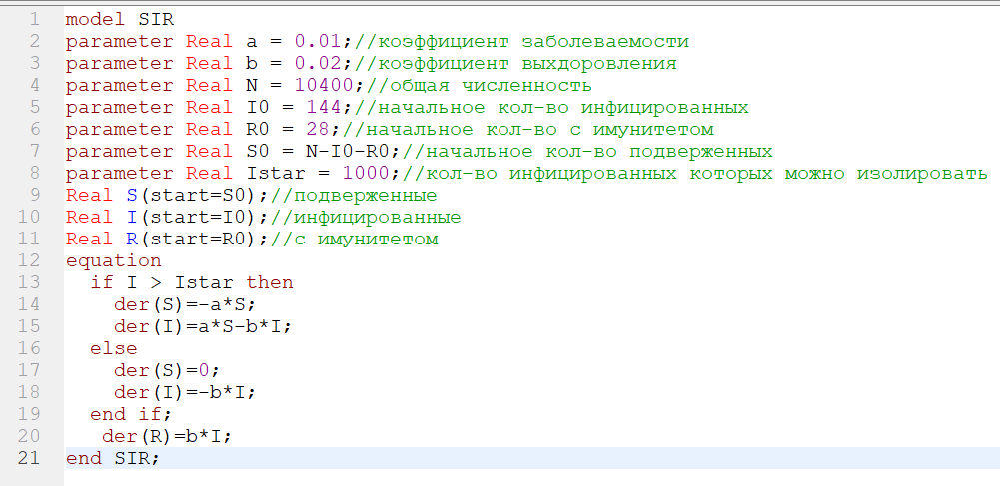
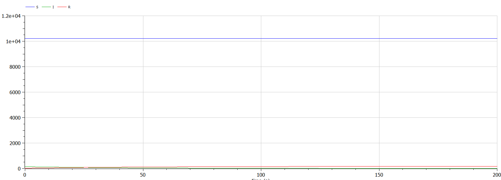
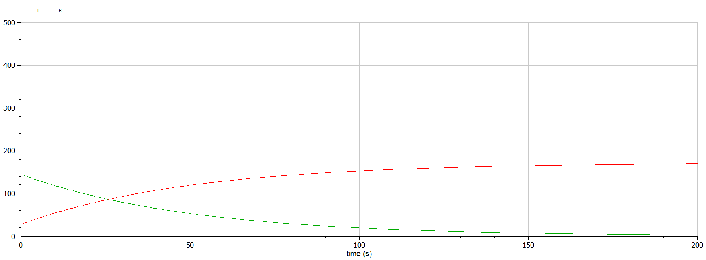
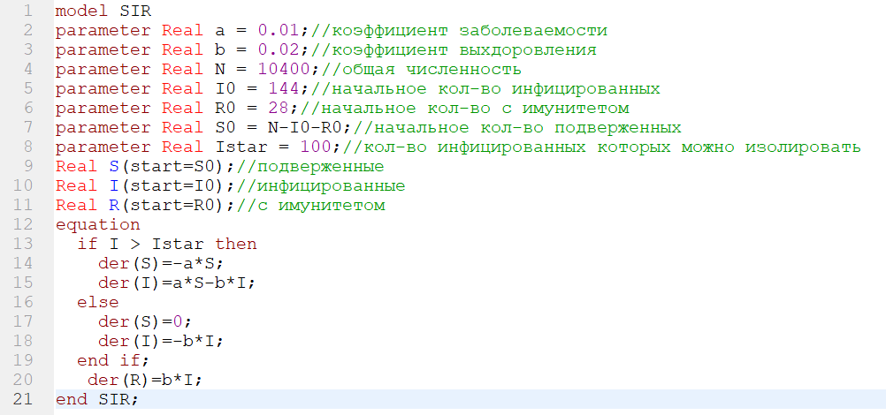
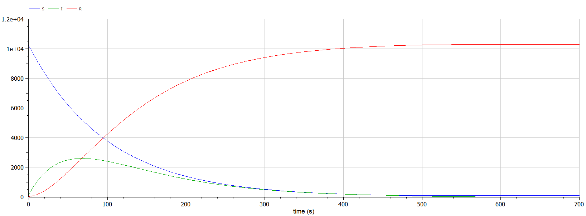

---
# Front matter
title: "Отчёт по лабораторной работе №6"
subtitle: "Задача об эпидемии"
author: "Ишанова А.И. группа НФИБД-02-19"

# Generic otions
lang: ru-RU
toc-title: "Содержание"

# Pdf output format
toc: true # Table of contents
toc_depth: 2
lof: true # List of figures
lot: false # List of tables
fontsize: 12pt
linestretch: 1.5
papersize: a4
documentclass: scrreprt
## I18n
polyglossia-lang:
  name: russian
  options:
	- spelling=modern
	- babelshorthands=true
polyglossia-otherlangs:
  name: english
### Fonts
mainfont: PT Serif
romanfont: PT Serif
sansfont: PT Sans
monofont: PT Mono
mainfontoptions: Ligatures=TeX
romanfontoptions: Ligatures=TeX
sansfontoptions: Ligatures=TeX,Scale=MatchLowercase
monofontoptions: Scale=MatchLowercase,Scale=0.9
## Biblatex
biblatex: true
biblio-style: "gost-numeric"
biblatexoptions:
  - parentracker=true
  - backend=biber
  - hyperref=auto
  - language=auto
  - autolang=other*
  - citestyle=gost-numeric
## Misc options
indent: true
header-includes:
  - \linepenalty=10 # the penalty added to the badness of each line within a paragraph (no associated penalty node) Increasing the value makes tex try to have fewer lines in the paragraph.
  - \interlinepenalty=0 # value of the penalty (node) added after each line of a paragraph.
  - \hyphenpenalty=50 # the penalty for line breaking at an automatically inserted hyphen
  - \exhyphenpenalty=50 # the penalty for line breaking at an explicit hyphen
  - \binoppenalty=700 # the penalty for breaking a line at a binary operator
  - \relpenalty=500 # the penalty for breaking a line at a relation
  - \clubpenalty=150 # extra penalty for breaking after first line of a paragraph
  - \widowpenalty=150 # extra penalty for breaking before last line of a paragraph
  - \displaywidowpenalty=50 # extra penalty for breaking before last line before a display math
  - \brokenpenalty=100 # extra penalty for page breaking after a hyphenated line
  - \predisplaypenalty=10000 # penalty for breaking before a display
  - \postdisplaypenalty=0 # penalty for breaking after a display
  - \floatingpenalty = 20000 # penalty for splitting an insertion (can only be split footnote in standard LaTeX)
  - \raggedbottom # or \flushbottom
  - \usepackage{float} # keep figures where there are in the text
  - \floatplacement{figure}{H} # keep figures where there are in the text
---

# Цель работы

Научиться строить модель эпидемии.

# Задание

Построить графики изменения числа особей в каждой из трех групп, рассмотреть, как будет протекать эпидемия в случаях:

1. если $I(0) \leq I^*$
2. если $I(0) > I^*$

## Вариант 18

На одном острове вспыхнула эпидемия. Известно, что из всех проживающих на острове $(N=10 400)$ в момент начала эпидемии $(t=0)$ число заболевших людей (являющихся распространителями инфекции) $I(0)=144$, а число здоровых людей с иммунитетом к болезни $R(0)=28$. Таким образом, число людей восприимчивых к болезни, но пока здоровых, в начальный момент времени $S(0)=N-I(0)- R(0)$.
Постройте графики изменения числа особей в каждой из трех групп. Рассмотрите, как будет протекать эпидемия в случае:

1. если $I(0) \leq I^*$
2. если $I(0) > I^*$

# Теоретическое введение

Компартментальные модели являются очень общей техникой моделирования. Они часто применяются для математического моделирования инфекционных заболеваний. Популяция присваивается отсекам с метками, например, S, I или R (восприимчивые, заразные или выздоровевшие). Люди могут перемещаться между отсеками.

Происхождение таких моделей относится к началу 20 века, с важными работами Росса в 1916 году, Росса и Хадсона в 1917 году, Кермака и МакКендрика в 1927 году и Кендалла в 1956 году.

Модели чаще всего работают с обыкновенными дифференциальными уравнениями (которые являются детерминированными), но также могут использоваться со стохастической (случайной) структурой, которая является более реалистичной, но гораздо более сложной для анализа.

Модели пытаются предсказать такие вещи, как распространение болезни, общее число инфицированных или продолжительность эпидемии, а также оценить различные эпидемиологические параметры, такие как репродуктивное число. Такие модели могут показать, как различные меры общественного здравоохранения могут повлиять на исход эпидемии, например, каков наиболее эффективный метод выпуска ограниченного количества вакцин для данной группы населения. [1]

Рассмотрим простейшую модель эпидемии. Предположим, что некая популяция, состоящая из N особей, (считаем, что популяция изолирована) подразделяется на три группы.

До того, как число заболевших не превышает критического значения $I^*$, считаем, что все больные изолированы и не заражают здоровых. Когда $I(t) > I^*$,
тогда инфицирование способны заражать восприимчивых к болезни особей. [2]

Изменения числа особей в группах происходит по следующим законам:

$$
\frac{dS}{dt} =
\begin{cases}
-\alpha S, I(t)>I^* \\
0, I(t) \leq I^*
\end{cases}
$$

$$
\frac{dI}{dt} =
\begin{cases}
-\alpha S - \beta I, I(t)>I^* \\
-\beta I, I(t) \leq I^*
\end{cases}
$$

$\frac{dR}{dt} = \beta I$

где $\alpha$ - коэффициент заболеваемости, $\beta -$ коэффициент выздоровления.

# Выполнение лабораторной работы

1. Пишем код для случая $I(0) \leq I^*$.(@fig:001)

{#fig:001 width=100%}

2. Компилируем, моделируем и получаем графики. (@fig:002 и @fig:003)

{#fig:002 width=100%}

{#fig:003 width=100%}

3. Пишем код для случая $I(0) > I^*$.(@fig:004)

{#fig:004 width=100%}

4. Компилируем, моделируем и получаем график. (@fig:005)

{#fig:005 width=100%}

# Вывод

В ходе выполнения лабораторной работы мы познакомились с моделью $SIR$, постороили графики для этой модели при $I(0) \leq I^*$ и $I(0) > I^*$.

# Список литературы

1. Wikipedia - Compartmental models in epidemiology (https://en.wikipedia.org/wiki/
Compartmental_models_in_epidemiology)[1]
2. Теоретические материалы курса.[2]
