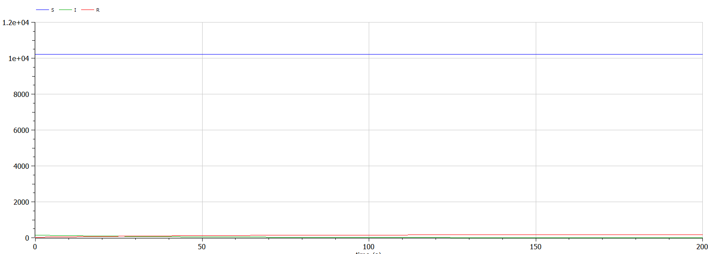
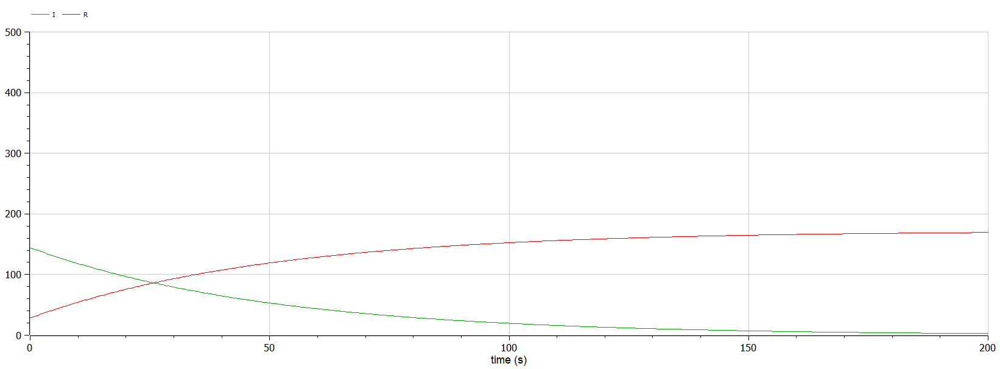

---
## Front matter
lang: ru-RU
title: Защита лабораторной работы №6 "Задача об эпидемии"
author: Ishanova A.I.
group: NI-202
institute: RUDN University, Moscow, Russian Federation
date: 2022 Mar 17th

## Formatting
toc: false
slide_level: 2
theme: metropolis
header-includes: 
 - \metroset{progressbar=frametitle,sectionpage=progressbar,numbering=fraction}
 - '\makeatletter'
 - '\beamer@ignorenonframefalse'
 - '\makeatother'
aspectratio: 43
section-titles: true
---

# Прагматика выполнения лабораторной работы

- разбор модели SIR
    - $I(0) \leq I^*$
   - $I(0) > I^*$
- знакомство с компартментальными моделями

# Цель лабораторной работы

Научиться строить модель SIR.

# Задачи выполнения лабораторной работы

Построить графики изменения числа особей в каждой из трех групп, рассмотреть, как будет протекать эпидемия в случаях:

1. если $I(0) \leq I^*$
2. если $I(0) > I^*$

#  Выполнение лабораторной работы

- реализуем в OpenModelica модель SIR c $I(0) \leq I^*$
- компилируем и получаем график
- меняем значение $I^*$, так что $I(0) > I^*$
- компилируем и получаем график

# Результаты выполнения лабораторной работы

- код модели SIR в OpenModelica
- графики для модели

## График для случая $I(0) \leq I^*$

{#fig:001 width=100%}

##

{#fig:002 width=100%}

## График для случая $I(0) > I^*$

{#fig:003 width=100%}
