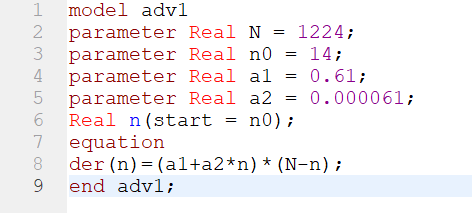
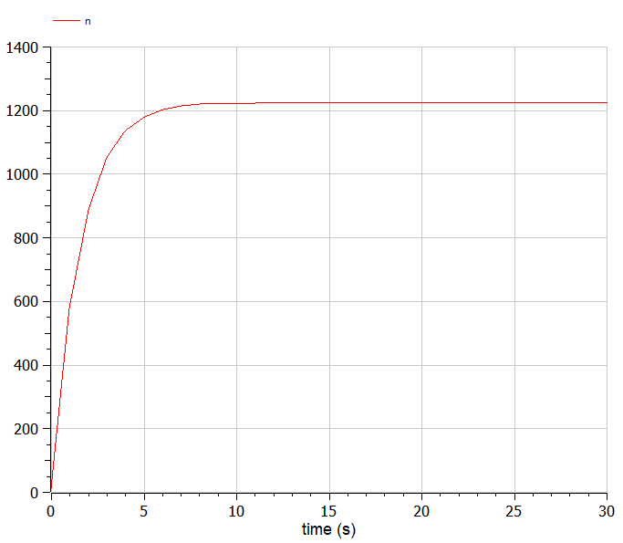
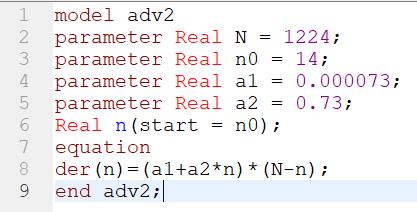
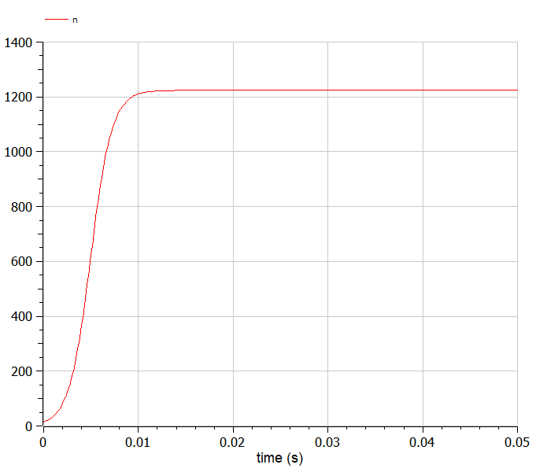
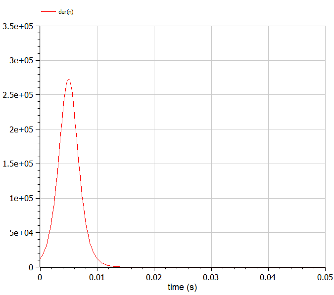
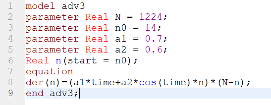
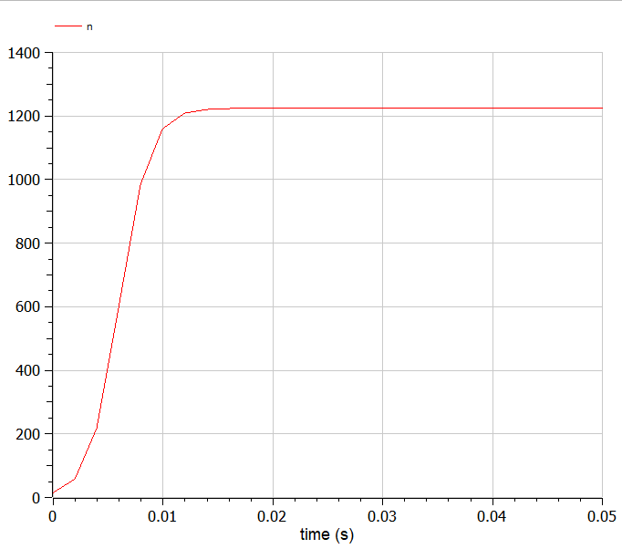

# Цель работы

Ознакомится с моделью эффективности рекламы и научиться ее моделировать.

# Задание работы

Постройте график распространения рекламы, математическая модель которой описывается следующим уравнением:

1. $$\frac{dn}{dt}=(\alpha_1+\alpha_2 \cdot n(t))(N-n(t)), \alpha_1 \gg \alpha_2$$
2. $$\frac{dn}{dt}=(\alpha_1+\alpha_2 \cdot n(t))(N-n(t)), \alpha_2 \gg \alpha_1$$
3. $$\frac{dn}{dt}=(a1 \cdot t+a2 \cdot \cos(t) \cdot n(t))(N-n(t))$$

### Вариант 18

1. $$\frac{dn}{dt}=(0.61+0.000061 \cdot n(t))(N-n(t))$$
2. $$\frac{dn}{dt}=(0.000073+0.73 \cdot n(t))(N-n(t))$$
3. $$\frac{dn}{dt}=(0.7 \cdot t+0.36 \cdot \cos(t) \cdot n(t))(N-n(t))$$

При этом объем аудитории $N=1224$, в начальный момент о товаре знает $n_0 = 14$ человек. Для случая 2 определите в какой момент времени скорость распространения рекламы будет иметь максимальное значение.

# Теоретическое введение

## Постановка задачи

Организуется рекламная кампания нового товара или услуги. Необходимо, чтобы прибыль будущих продаж с избытком покрывала издержки на рекламу. Вначале расходы могут превышать прибыль, поскольку лишь малая часть потенциальных покупателей будет информирована о новинке. Затем, при увеличении числа продаж, возрастает и прибыль, и, наконец, наступит момент, когда рынок насытиться, и рекламировать товар станет бесполезным.
Предположим, что торговыми учреждениями реализуется некоторая продукция, о которой в момент времени t из числа потенциальных покупателей N знает лишь n покупателей. Для ускорения сбыта продукции запускается реклама по радио, телевидению и других средств массовой информации. После запуска рекламной кампании информация о продукции начнет распространяться среди потенциальных покупателей путем общения друг с другом. Таким образом, после запуска рекламных объявлений скорость изменения числа знающих о продукции людей пропорциональна как числу знающих о товаре покупателей, так и числу покупателей о нем не знающих. [1]

## Модель

Модель рекламной кампании описывается следующими величинами. Считаем, что $\frac{dn}{dt}$ - скорость изменения со временем числа потребителей, узнавших о товаре и готовых его купить, t - время, прошедшее с начала рекламной кампании, n(t) - число уже информированных клиентов. Эта величина пропорциональна числу покупателей, еще не знающих о нем, это описывается следующим образом: $\alpha_1(t)(N-n(t))$, где N - общее число потенциальных платежеспособных покупателей, $\alpha_1$(t)>0 - характеризует интенсивность рекламной кампании (зависит от затрат на рекламу в данный момент времени). Помимо этого, узнавшие о товаре потребители также распространяют полученную информацию среди потенциальных покупателей, не знающих о нем (в этом случае работает т.н. сарафанное радио). Этот вклад в рекламу описывается величиной $\alpha_2(t)(N-n(t))$, эта величина увеличивается с увеличением потребителей узнавших о товаре. Математическая модель распространения рекламы описывается уравнением:

$$\frac{dn}{dt}=(\alpha_{1}(t)+\alpha_{2}(t) \cdot n(t))(N-n(t))$$

При $\alpha_1(t) \gg \alpha_2(t)$ получается модель типа модели Мальтуса, а в обратном случае, при $\alpha_1(t) \ll \alpha_2(t)$ получаем уравнение логистической кривой.[1]

# Выполнение лабораторной работы

## Код в OpenModelica

1. Пишем код для первого случая. (@fig:001)

{#fig:001 width=100%}

2. Компилируем и получаем график. (@fig:002)

{#fig:002 width=100%}

3. Пишем код для второго случая. (@fig:003)

{#fig:003 width=100%}

4. Компилируем и получаем график. (@fig:004)

{#fig:004 width=100%}

5. Для того, чтобы найти максимальную скорость распространения смотрим на график производной. (@fig:005)

{#fig:005 width=100%}

Скорость распространения рекламы будет иметь максимальное значение между $0.04$ и $0.06$ ед.времени.

6. Пишем код для второго случая. (@fig:006)

{#fig:006 width=100%}

7. Компилируем и получаем график. (@fig:007)

{#fig:007 width=100%}

# Вывод

В ходе выполнения работы были построены три разных модели эффективности рекламы. Для второго случая также нашли момент, когда скорость распространения рекламы максимальна.

# Список литературы

1. Теоретические материалы курса.
