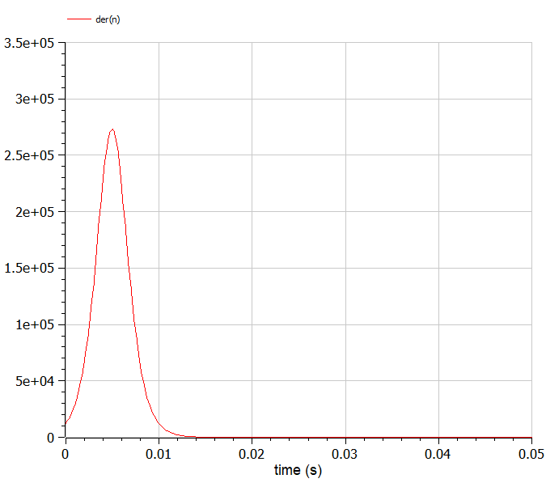
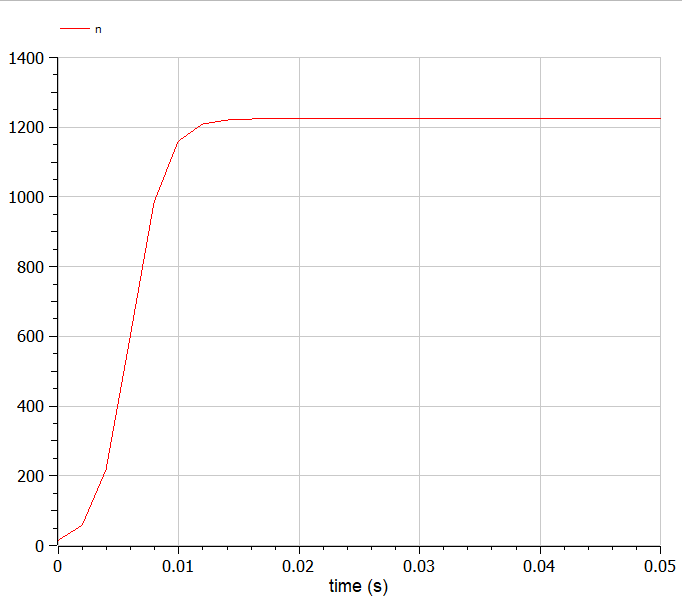

# Прагматика выполнения лабораторной работы

- знакомство с моделью эффективности рекламы
- рассмотр изменения результатов в зависимости от изменения параметров
- рассмотр изменения результатов в зависимости от способа описания модели через дифференциальные уравнения

# Цель работы

Ознакомится с моделью эффективности рекламы и научиться ее моделировать.

# Задание работы

Постройте график распространения рекламы, математическая модель которой описывается следующим уравнением:

1. $$\frac{dn}{dt}=(\alpha_1+\alpha_2 \cdot n(t))(N-n(t)), \alpha_1 \gg \alpha_2$$
2. $$\frac{dn}{dt}=(\alpha_1+\alpha_2 \cdot n(t))(N-n(t)), \alpha_2 \gg \alpha_1$$
3. $$\frac{dn}{dt}=(a1 \cdot t+a2 \cdot \cos(t) \cdot n(t))(N-n(t))$$

#  Выполнение лабораторной работы

- реализуем в OpenModelica модель  для случая $$\frac{dn}{dt}=(\alpha_1+\alpha_2 \cdot n(t))(N-n(t)), \alpha_1 \gg \alpha_2$$
- компилируем и получаем график
- реализуем в OpenModelica модель  для случая $$\frac{dn}{dt}=(\alpha_1+\alpha_2 \cdot n(t))(N-n(t)), \alpha_2 \gg \alpha_1$$
- компилируем и получаем график
- находим максимум скорости по графику производной
- реализуем в OpenModelica модель  для случая $$\frac{dn}{dt}=(a1 \cdot t+a2 \cdot \cos(t) \cdot n(t))(N-n(t))$$
- компилируем и получаем график

# Результаты выполнения лабораторной работы

- код модели эффективности рекламы в OpenModelica для трех случаев
- графики для моделей

## График для 1 случая

{#fig:001 width=80%}

## График для 2 случая

{#fig:002 width=80%}

## График для 2 случая - максимум скорости

{#fig:003 width=80%}

## График для 3 случая

{#fig:004 width=80%}
