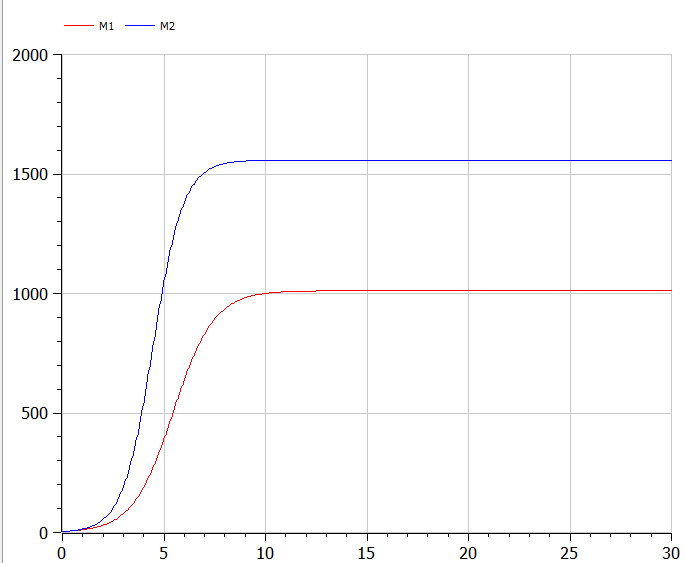

---
# Front matter
title: "Лабораторная работа №8"
subtitle: "Модель конкуренции двух фирм"
author: "Ишанова А.И. группа НФИбд-02-19"

# Generic otions
lang: ru-RU
toc-title: "Содержание"

# Pdf output format
toc: true # Table of contents
toc_depth: 2
lof: true # List of figures
lot: false # List of tables
fontsize: 12pt
linestretch: 1.5
papersize: a4
documentclass: scrreprt
## I18n
polyglossia-lang:
  name: russian
  options:
	- spelling=modern
	- babelshorthands=true
polyglossia-otherlangs:
  name: english
### Fonts
mainfont: PT Serif
romanfont: PT Serif
sansfont: PT Sans
monofont: PT Mono
mainfontoptions: Ligatures=TeX
romanfontoptions: Ligatures=TeX
sansfontoptions: Ligatures=TeX,Scale=MatchLowercase
monofontoptions: Scale=MatchLowercase,Scale=0.9
## Biblatex
biblatex: true
biblio-style: "gost-numeric"
biblatexoptions:
  - parentracker=true
  - backend=biber
  - hyperref=auto
  - language=auto
  - autolang=other*
  - citestyle=gost-numeric
## Misc options
indent: true
header-includes:
  - \linepenalty=10 # the penalty added to the badness of each line within a paragraph (no associated penalty node) Increasing the value makes tex try to have fewer lines in the paragraph.
  - \interlinepenalty=0 # value of the penalty (node) added after each line of a paragraph.
  - \hyphenpenalty=50 # the penalty for line breaking at an automatically inserted hyphen
  - \exhyphenpenalty=50 # the penalty for line breaking at an explicit hyphen
  - \binoppenalty=700 # the penalty for breaking a line at a binary operator
  - \relpenalty=500 # the penalty for breaking a line at a relation
  - \clubpenalty=150 # extra penalty for breaking after first line of a paragraph
  - \widowpenalty=150 # extra penalty for breaking before last line of a paragraph
  - \displaywidowpenalty=50 # extra penalty for breaking before last line before a display math
  - \brokenpenalty=100 # extra penalty for page breaking after a hyphenated line
  - \predisplaypenalty=10000 # penalty for breaking before a display
  - \postdisplaypenalty=0 # penalty for breaking after a display
  - \floatingpenalty = 20000 # penalty for splitting an insertion (can only be split footnote in standard LaTeX)
  - \raggedbottom # or \flushbottom
  - \usepackage{float} # keep figures where there are in the text
  - \floatplacement{figure}{H} # keep figures where there are in the text
---

# Цель работы

Ознакомиться с моделью конкуренции фирм, реализовать модель в OpenModelica.

# Задание работы

1. Построить графики изменения оборотных средств фирмы 1 и фирмы 2 без учета постоянных издержек и с введенной нормировкой для случая 1.
2. Построить графики изменения оборотных средств фирмы 1 и фирмы 2 без учета постоянных издержек и с введенной нормировкой для случая 2.

### Вариант 18

*Случай 1.* Рассмотрим две фирмы, производящие взаимозаменяемые товары одинакового качества и находящиеся в одной рыночной нише. Считаем, что в рамках нашей модели конкурентная борьба ведётся только рыночными методами. То есть, конкуренты могут влиять на противника путем изменения параметров своего производства: себестоимость, время цикла, но не могут прямо вмешиваться в ситуацию на рынке («назначать» цену или влиять на потребителей каким-либо иным способом.) Будем считать, что постоянные издержки пренебрежимо малы, и в модели учитывать не будем. В этом случае динамика изменения объемов продаж фирмы 1 и фирмы 2 описывается следующей системой уравнений:

$$\frac{dM_1}{d\theta}=M_{1}-\frac{b}{c_1}M_{1}M_{2}-\frac{a_1}{c_1}M_{1}^2$$

$$\frac{dM_2}{d\theta}=\frac{c_2}{c_1}M_{2}-\frac{b}{c_1}M_{1}M_{2}-\frac{a_2}{c_1}M_{2}^2$$

где $a_1 = \frac{p_{cr}}{\tau_{1}^{2}\widetilde{p_{1}}^{2}Nq}$,  $a_2 = \frac{p_{cr}}{\tau_{2}^{2}\widetilde{p_{2}}^{2}Nq}$,  $b = \frac{p_{cr}}{\tau_{1}^{2}\widetilde{p_{1}}^{2}\tau_{2}^{2}\widetilde{p_{2}}^{2}Nq}$, $c_1 = \frac{p_{cr}-\widetilde{p_{1}}}{\tau_{1}\widetilde{p_{1}}}$, $c_2 = \frac{p_{cr}-\widetilde{p_{2}}}{\tau_{2}\widetilde{p_{2}}}$

Также введена нормировка $t = c_1\theta$

*Случай 2.* Рассмотрим модель, когда, помимо экономического фактора влияния(изменение себестоимости, производственного цикла, использование кредита и т.п.), используются еще и социально-психологические факторы – формирование общественного предпочтения одного товара другому, не зависимо от их качества и цены. В этом случае взаимодействие двух фирм будет зависеть друг от друга, соответственно коэффициент перед $M_{1}M_{2}$ будет отличаться. Пусть в рамках рассматриваемой модели динамика изменения объемов продаж фирмы 1 и фирмы 2 описывается следующей системой уравнений:

$$\frac{dM_1}{d\theta}=M_{1}-\frac{b}{c_1}M_{1}M_{2}-\frac{a_1}{c_1}M_{1}^2$$

$$\frac{dM_2}{d\theta}=\frac{c_2}{c_1}M_{2}-(\frac{b}{c_1}+0.0009)M_{1}M_{2}-\frac{a_2}{c_1}M_{2}^2$$

Для обоих случаев рассмотрим задачу со следующими начальными условиями и параметрами:

$M_{0}^{1}=4.2, M_{0}^{2}=3.8, p_{cr}=11.4, N=26, q=1, \tau_{1}=14, \tau_{2}=22, \widetilde{p_{1}}=6.6, \widetilde{p_{2}}=4.5$.

**Замечание:**

Значения $p_{cr}, \widetilde{p_{1,2}}, N$ указаны в тысячах единиц, а значения $M_{1,2}$ указаны в млн. единиц.

**Обозначения:**

N – число потребителей производимого продукта.

$\tau$ – длительность производственного цикла.

p – рыночная цена товара.

$\widetilde{p}$ – себестоимость продукта, то есть переменные издержки на производство единицы продукции.

q – максимальная потребность одного человека в продукте в единицу времени.

$\theta=\frac{t}{c_1}$ - безразмерное время.

1. Постройте графики изменения оборотных средств фирмы 1 и фирмы 2 без учета постоянных издержек и с введенной нормировкой для случая 1.
2. Постройте графики изменения оборотных средств фирмы 1 и фирмы 2 без учета постоянных издержек и с введенной нормировкой для случая 2.

# Теоретическое введение

**Модель одной фирмы**

Для построения модели конкуренции хотя бы двух фирм необходимо рассмотреть модель одной фирмы. Вначале рассмотрим модель фирмы, производящей продукт долговременного пользования, когда цена его определяется балансом спроса и предложения. Примем, что этот продукт занимает определенную нишу рынка и конкуренты в ней отсутствуют.

Обозначим:

$N$ – число потребителей производимого продукта.

$S$ – доходы потребителей данного продукта. Считаем, что доходы всех потребителей одинаковы. Это предположение справедливо, если речь идет об одной рыночной нише, т.е. производимый продукт ориентирован на определенный слой населения.

$M$ – оборотные средства предприятия.

$\tau$ – длительность производственного цикла.

$p$ – рыночная цена товара.

$\widetilde{p}$ – себестоимость продукта, то есть переменные издержки на производство единицы продукции.

$\delta$ – доля оборотных средств, идущая на покрытие переменных издержек.

$\kappa$ – постоянные издержки, которые не зависят от количества выпускаемой продукции.

$Q(S/p)$ – функция спроса, зависящая от отношения дохода S к цене p. Она равна количеству продукта, потребляемого одним потребителем в единицу времени.

Функцию спроса товаров долговременного использования часто представляют в простейшей форме:

$$Q = q-k\frac{p}{S} = q(1-\frac{p}{P_{cr}})$$

где q – максимальная потребность одного человека в продукте в единицу времени. Эта функция падает с ростом цены и при p = $p_{cr}$ (критическая стоимость продукта) потребители отказываются от приобретения товара. Величина $p_{cr}$ = Sq/k. Параметр k – мера эластичности функции спроса по цене. Таким образом, функция спроса в форме выше является пороговой (то есть, Q(S/p) = 0 при $p\geq p_{cr}$) и обладает свойствами насыщения.

Уравнения динамики оборотных средств можно записать в виде:

$$\frac{dM}{dt} = -\frac{M\delta}{\tau}+NQp-\kappa = -\frac{M\delta}{\tau}+Nq(1-\frac{p}{p_{cr}})p-\kappa$$

Уравнение для рыночной цены p представим в виде:

$$\frac{dp}{dt}=\gamma(-\frac{M\delta}{\tau\widetilde{p}}+Nq(1-\frac{p}{p_{cr}}))$$

Первый член соответствует количеству поставляемого на рынок товара (то есть, предложению), а второй член – спросу.

Параметр $\gamma$ зависит от скорости оборота товаров на рынке. Как правило, время торгового оборота существенно меньше времени производственного цикла $\tau$. При заданном M уравнение описывает быстрое стремление цены к равновесному значению цены, которое устойчиво.

В этом случае уравнение можно заменить алгебраическим соотношением:

$$-\frac{M\delta}{\tau\widetilde{p}}+Nq(1-\frac{p}{p_{cr}})=0$$

Из этого следует, что равновесное значение цены p равно:

$$p=p_{cr}(1-\frac{M\delta}{\tau\widetilde{p}Nq})$$

Уравнение приобретает вид:

$$\frac{dM}{dt} =M\frac{\delta}{\tau}(\frac{p_{cr}}{\widetilde{p}}-1)-M^{2}(\frac{\delta}{\tau\widetilde{p}})^{2}\frac{p_{cr}}{Nq}-\kappa$$

Уравнение имеет два стационарных решения, соответствующих условию dM/dt = 0:

$$\widetilde{M_{1,2}}=\frac{1}{2}a\pm\sqrt{\frac{a^2}{4}-b}$$

где

$$a=Nq(1-\frac{\widetilde{p}}{p_{cr}})\widetilde{p}\frac{\tau}{\delta}, b=\kappa Nq\frac{(\tau\widetilde{p})^2}{p_{cr}\delta^2}$$

Cледует, что при больших постоянных издержках (в случае $a^2 < 4b$) стационарных состояний нет. Это означает, что в этих условиях фирма не может функционировать стабильно, то есть, терпит банкротство. Однако, как правило, постоянные затраты малы по сравнению с переменными (то есть, $b \ll a^2$) и играют роль, только в случае, когда оборотные средства малы. При $b \ll a$ стационарные значения M равны.

$$\widetilde{M_{+}}=Nq\frac{\tau}{\delta}(1-\frac{\widetilde{p}}{p_{cr}})\widetilde{p}, \widetilde{M_{-}}=\kappa\widetilde{p}\frac{\tau}{\delta(p_{cr}-\widetilde{p}}$$

Первое состояние $\widetilde{M_{+}}$ устойчиво и соответствует стабильному функционированию предприятия. Второе состояние $\widetilde{M_{-}}$ неустойчиво, так, что при $M < \widetilde{M_{-}}$ оборотные средства падают (dM/dt < 0), то есть, фирма идет к банкротству. По смыслу $\widetilde{M_{-}}$ соответствует начальному капиталу, необходимому для входа в рынок.

В обсуждаемой модели параметр $\delta$ всюду входит в сочетании с $\tau$. Это значит, что уменьшение доли оборотных средств, вкладываемых в производство, эквивалентно удлинению производственного цикла. Поэтому мы в дальнейшем положим:  $\delta$ = 1, а параметр $\tau$ будем считать временем цикла, с учётом сказанного.[1]

# Выполнение лабораторной работы

1. Пишем код для первого случая. (@fig:001)

{#fig:001 width=100%}

2. Компилируем и получаем график. (@fig:002)

{#fig:002 width=100%}

3. Пишем код для второго случая.(@fig:003).

{#fig:003 width=100%}

4. Компилируем и получаем график. (@fig:004)

{#fig:004 width=100%}

# Вывод

В ходе выполнения данной работы мы познакомились с моделью конкуренции фирм, реализовали модели в случае, когда не учитываются социально-психологические факторы, и в случае, когда они учитываются. И получили два графика зависимости оборотных средст предприятий от нормированного времени.

# Список литературы

1. Теоретические материалы курса.
