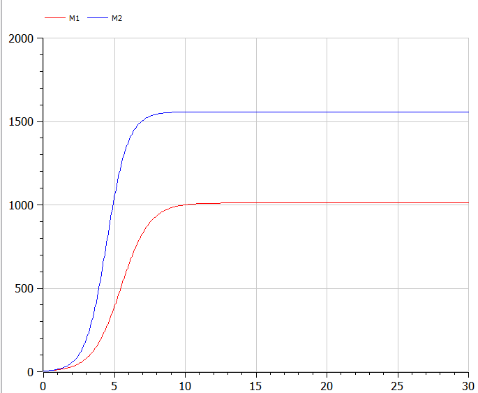
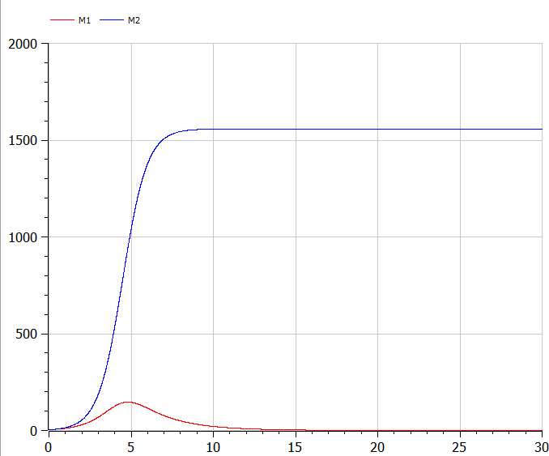

# Прагматика выполнения лабораторной работы

- знакомство с моделью конкуренции фирм
- рассмотр изменения результатов в зависимости от учитывания социально-психологических факторов

# Цель работы

Ознакомится с моделью конкуренции фирм и научиться ее моделировать.

# Задание работы

1. Построить графики изменения оборотных средств фирмы 1 и фирмы 2 без учета постоянных издержек и с введенной нормировкой для случая 1.
2. Построить графики изменения оборотных средств фирмы 1 и фирмы 2 без учета постоянных издержек и с введенной нормировкой для случая 2.

## Случай 1

$$\frac{dM_1}{d\theta}=M_{1}-\frac{b}{c_1}M_{1}M_{2}-\frac{a_1}{c_1}M_{1}^2$$

$$\frac{dM_2}{d\theta}=\frac{c_2}{c_1}M_{2}-\frac{b}{c_1}M_{1}M_{2}-\frac{a_2}{c_1}M_{2}^2$$

где $a_1 = \frac{p_{cr}}{\tau_{1}^{2}\widetilde{p_{1}}^{2}Nq}$,  $a_2 = \frac{p_{cr}}{\tau_{2}^{2}\widetilde{p_{2}}^{2}Nq}$,  $b = \frac{p_{cr}}{\tau_{1}^{2}\widetilde{p_{1}}^{2}\tau_{2}^{2}\widetilde{p_{2}}^{2}Nq}$, $c_1 = \frac{p_{cr}-\widetilde{p_{1}}}{\tau_{1}\widetilde{p_{1}}}$, $c_2 = \frac{p_{cr}-\widetilde{p_{2}}}{\tau_{2}\widetilde{p_{2}}}$

Также введена нормировка $t = c_1\theta$

## Случай 2

$$\frac{dM_1}{d\theta}=M_{1}-\frac{b}{c_1}M_{1}M_{2}-\frac{a_1}{c_1}M_{1}^2$$

$$\frac{dM_2}{d\theta}=\frac{c_2}{c_1}M_{2}-(\frac{b}{c_1}+0.0009)M_{1}M_{2}-\frac{a_2}{c_1}M_{2}^2$$

где $a_1 = \frac{p_{cr}}{\tau_{1}^{2}\widetilde{p_{1}}^{2}Nq}$,  $a_2 = \frac{p_{cr}}{\tau_{2}^{2}\widetilde{p_{2}}^{2}Nq}$,  $b = \frac{p_{cr}}{\tau_{1}^{2}\widetilde{p_{1}}^{2}\tau_{2}^{2}\widetilde{p_{2}}^{2}Nq}$, $c_1 = \frac{p_{cr}-\widetilde{p_{1}}}{\tau_{1}\widetilde{p_{1}}}$, $c_2 = \frac{p_{cr}-\widetilde{p_{2}}}{\tau_{2}\widetilde{p_{2}}}$

#  Выполнение лабораторной работы

- реализуем в OpenModelica модель  для случая, когда не учитываются социально-психологические факторы
- компилируем и получаем график
- реализуем в OpenModelica модель  для случая, когда учитываются социально-психологические факторы
- компилируем и получаем график

# Результаты выполнения лабораторной работы

- код модели конкуренции фирм в OpenModelica для двух случаев
- графики для моделей

## График для 1 случая

{#fig:001 width=80%}

## График для 2 случая

{#fig:002 width=80%}
